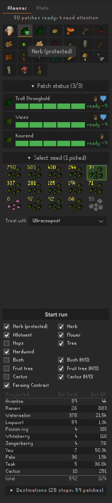
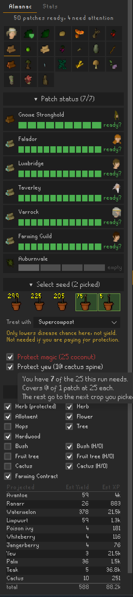

# Doogle Maps

A RuneLite plugin that keeps a live overview of every farming patch you use — so you can see your
whole farm without running around it, plan a run against what is actually ready, and be walked
through it patch by patch.

## The overview

Every patch you use on one page, grouped the way the Geomancy interface groups them: what is
growing, how long is left, and a shield where the patch cannot be diseased. Hover a bar for the
time remaining.

- **Fills itself in as you play.** Rake, compost, plant, pay the farmer, check health, harvest —
  the plugin follows each step and remembers it. Walking past a patch is enough to refresh it.
- **Needs no Geomancy.** The Lunar spell is not required, not asked for, and not used — walking
  past a patch is all it takes.
- **Keeps growing while you are logged out**, and recomputes every timer on login against the
  game's growth-tick grid.
- **Says when it is guessing.** An unprotected crop can catch a disease you were not there to see,
  so its timer is shown as an estimate; protected and immune crops get a solid one.
- **Starts populated.** RuneLite's Time Tracking has been recording the same varbits for as long
  as your account has existed, so on first run the gaps are seeded from it — and nothing is ever
  written back to its data.
- **Per-patch switches**, so anything your account cannot reach disappears everywhere rather than
  sitting there greyed out.
- **An in-game infobox** counting what is ready, with the list on hover.

Multiple accounts need no setup: RuneLite scopes the cache per profile.

## Planning a run

Pick the patch types and the seeds, and the panel prices the trip before you set off — expected
yield and experience per crop, inventory slots needed against the 28 you have, and every
destination it will visit.

- **Yield is computed, not guessed.** Chance-to-save from the published constants, with magic
  secateurs, the Farming cape, attas, the Farmer's outfit and the Kandarin and Kourend diary
  bonuses all *detected* rather than asked for. Compost is the one thing you choose, because it
  has not been applied yet.
- **Discounted for disease**, using the real per-crop rates and where each patch is — a ranarr in
  Weiss cannot be diseased at all.
- **Routed through Shortest Path**, as a soft dependency. It is handed the whole outstanding set
  and picks the cheapest next stop, so there is no route-ordering guesswork here.

## What to take

A loadout for the trip: seeds, protection payments, the best axe you can actually swing, storage,
and any teleport you own that reaches somewhere this run goes.

Items still to withdraw are highlighted in the bank. Things the tool leprechaun already holds are
marked differently, so you leave them where they are rather than carrying a rake around the map.

## Guided mode

That is what the shot at the top is showing. It follows Quest Helper's idiom, because that is the
one players already read: the patch, the leprechaun or the inventory item you need next is
outlined, one step at a time, with the same instruction in words on screen.

Harvest, note at the leprechaun when the pack fills, rake, compost, plant — and the empty buckets
handed back before you move on.

Nothing is clicked for you.

## Farming contracts

Guildmaster Jane's contract is the highest-value thing in a run, and it wants one specific patch.
While one is assigned it gets its own tab — her face, pinned first — with the crop she asked for
already selected, and the Farming Guild patch it needs is taken out of the ordinary run so nothing
else can be planted in it. The guide services it first when you arrive, then offers to hand a
finished one in and take the next before you leave.

## Stats

Every patch picked clean is recorded with what was predicted for it, so the Stats tab doubles as a
running check on the estimates: lifetime totals, per-crop averages against prediction, and a
per-compost split. Kept locally; nothing is sent anywhere.

## Compliance

Read-only and display-only. The plugin highlights and instructs; you perform every click. No input
automation, no auto-walking, no auto-withdrawing — the same model Quest Helper uses. It also never
suggests buying anything on the Grand Exchange, so it works the same for an ironman as for a main.

## Planned

Crowdsourced yield data once the plugin is on the Hub, and a stats tab for what the harvest log can
already answer. `docs/TODO.md` has what is open.

## Licence and attribution

BSD 2-Clause — see [LICENSE](LICENSE).

Patch locations, varbits, crop decoding and growth timings are mirrored from RuneLite core's Time
Tracking plugin. See [ATTRIBUTION.md](ATTRIBUTION.md).

## Building it yourself

Building, running the client and regenerating the generated data are all in
[DEVELOPMENT.md](DEVELOPMENT.md).
