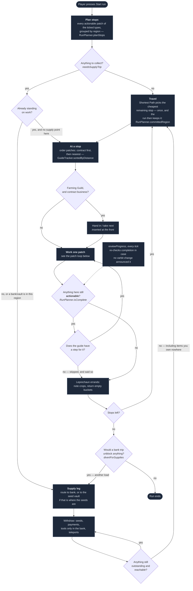
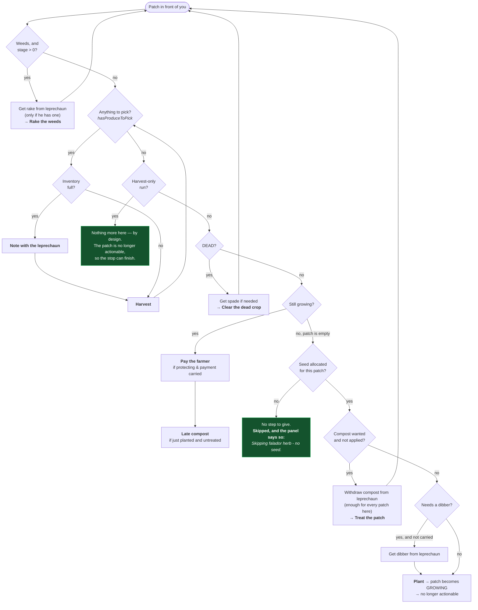

# What the player actually does during a run

The click-and-move loop guided mode drives, end to end, with the points where it can **stall**
marked. Built by tracing `RunPlanner` → `GuideTracker` → `GuidePlan` → `PatchInteractionTracker`.

Read the red nodes first. They were the states a run could enter and not leave.

> **Status: all four fixed**, and a fifth found later — a run *ending* a load early, out of the
> same exemption machinery. Completion is derived from patch state and polled once a tick, so a
> stop ends when nothing at it is actionable rather than when every patch has been watched being
> planted — and a patch the guide has no step for is skipped rather than waited on, with the panel
> saying which and why. See *A fifth stall* below, and *What is still open*, which is no longer
> empty.

---

## The whole run

### Two loops the diagram now has that it did not

**The run can go back for another load.** A pack holds one load, and a compost bin's fill is
un-noted and unstackable — fifteen items for a normal bin, thirty for the guild's — so *more
than one trip is the normal case for bins rather than an edge*. "Every stop is finished" and
"there is nothing left to do" stopped being the same statement, and the run used to end on the
first one: bins half full, five hundred pineapples still in the bank. `divertForSupplies` asks
the withdraw list one question at the moment the run would otherwise end — *would going to a
bank unblock anything* — and makes the trip the next leg instead of the epitaph. Nothing
unobtainable can loop it: a row goes `MISSING` rather than `WITHDRAW` when the bank has none.

**The destination is chosen once per leg, not once per region crossing.** Handing Shortest Path
every outstanding stop and letting it pick the cheapest is still the ordering strategy — but
"cheapest" is measured from where the player is, and `GuideTracker.retargetIfMoved` re-asks on
every region change. So the answer moved *while travelling to it*: cross a boundary on the way
to Weiss and Ardougne might now be nearer, taking the drawn line, the destination name, the
via-hops and the highlighted teleport with it. With several run types ticked there is always
another stop close enough to win a leg. The pick is now latched until the stop leaves
`getRemaining()` — finished, or waved past — and the next leg is chosen greedily all over again
from wherever the player then is.

## One patch, click by click

`GuidePlan.forPatch` — a pure function of the patch's current state, re-derived every tick.
The first matching branch wins and returns; there is no progress counter anywhere.

---

## The four stalls, and why they were one bug

**As it was:** a stop completed only when every patch at it had been marked serviced
(`serviced.size() >= patches.size()`), and a patch was marked serviced only when its varbit changed
into a state holding a growing crop. Put together — **the run only advanced if you fully planted
every patch at every stop.**

**As it is now:** a stop is complete when nothing at it is actionable, asked of the patches rather
than counted, and re-asked once a tick so it cannot depend on an event arriving.

| # | Situation | What happens |
| --- | --- | --- |
| 1 | **Harvest-only run** — **FIXED** | A picked-clean bush or fruit tree still decodes as `HARVESTABLE` — verified: 19 such varbit states, stock 0. `PatchProjection.hasProduceToPick()` now separates "grown" from "laden", so the stop ends when the fruit is gone. |
| 2 | **No seed for a patch** — **FIXED** | The guide reports every patch it has no step for; the planner stops waiting on those. The panel says *"Skipping falador herb - no seed."* rather than skipping silently. |
| 3 | **Cannot clear a patch** — **FIXED** | Same mechanism: no step means nothing to wait for. Only the no-seed case gets a worded reason, because that is the one the player can act on. |
| 4 | **Patch turns out to want nothing** — **FIXED** | Included optimistically when never seen. Now caught by `reviewProgress()`, polled each tick, because arriving at such a patch fires no varbit *transition* to report. |

When a stop stalls, nothing reports a completed stop, so `retarget()` is never called. And
`retarget` clears the router whenever you are standing in a region with outstanding work — so the
visible symptom is **no route drawn and no next instruction**, which reads as the plugin freezing
rather than as a patch it is waiting on. No stop can now reach that state.

### The underlying contradiction

`GuidePlan`'s own class comment states the design rule:

> The whole of guided mode's judgement lives here, and it is deliberately a **pure function of the
> patch's current state** — no progress counter, no "which step am I on" stored anywhere. […] A
> stored step index has to be kept in step with a player who does things out of order, walks away,
> or gets the compost on before you told them to.

`RunStop` does the opposite. It accumulates a `serviced` set — a progress counter, kept in step by
one event that fires on one transition. The two halves of the same feature are built on opposite
principles, and the accumulating half is the one that strands the run.

### What was done

Completion is **derived**, matching the half that already worked:

- `PatchProjection.hasProduceToPick()` separates *grown* from *laden*, so a picked-clean regrowing
  crop stops being worth visiting. Fixes stall 1.
- `RunPlanner.isComplete(RunStop)` asks whether any patch is still actionable — the same test the
  stop was built from, so a stop ends exactly when it would no longer be created.
- `RunStop.isComplete` became `isFullyServiced` and nothing depends on it to end a run.
- `markServiced` became `onPatchChanged`: the capture layer reports the *event*, the planner
  decides the *meaning*. It no longer needs an opinion about what a run considers finished.
- `RunPlanner.reviewProgress()`, polled each tick, catches a stop that finished without any varbit
  transition to announce it. Fixes stall 4.

### A fifth stall, found later, and the same shape as the other four

**The run ended a load early.** Not a stall — the opposite, a run finishing when it should not
have — but it came out of the same machinery, so it belongs here. A stop is complete when
nothing at it is actionable *or the guide has no step for it*, and that second clause is exactly
what a part-filled compost bin looks like once the produce runs out: still `FILLING`, still
wanting fifteen more, and `CompostBinPlan.addFillStep` deliberately silent because a bin takes
no notes and there were none in the pack. Every stop read complete and the run deactivated.

The exemption clause is right and is what fixed stalls 2 and 3; what was missing was asking, at
the moment it produces a finished run, whether the reason everything is exempt is one a bank
trip would fix. See `divertForSupplies` above.

### What is still open

Two things in this loop, both about a stop knowing where it is.

**A stop can stand in more ground than it is filed under.** `RunStop.claimsRegion` now covers
the case that bit: the coral nurseries are region 13194 while their stop is filed under the
Great Conch at 12581, so every "am I there yet" test compared the wrong pair of numbers and
answered no — the run routed the player back *up* the steps they had just come down, produced
no step for the patches in front of them, and opened at a bank with weedy patches underfoot.
Fixed for the underwater families, whose seabed is written down in `UnderwaterApproach`. It is
not a general answer: any other patch whose region differs from its `FarmRegion` would fail the
same way and there is no test that would notice.

**A stop can be two places.** The Great Conch carries two coral nurseries on the seabed *and* a
calquat on the deck, one `RunStop` because their varbits arrive together. Routing hands the
router both and lets it pick, but the guide will list the calquat's steps while you are
underwater, and the stop cannot complete until you surface for it. Splitting the stop is the
obvious fix and has not been done.

The gap this section used to name — a contract taken mid-run having no way to fetch its seed — is
closed. The cause was not the missing machinery it looked like: `RunPlanner.selectedForThisRun`
resolved seeds by patch **type**, and a contract's seed is derived from the assignment rather than
picked, so it was never in the set that overload filters. The planner could not see it while
`RunLoadout`, which resolves by planting **group**, could — so the withdraw list asked for a yew
that no routing decision knew about. Both resolve by group now.

The supply leg also ends on the withdraw list rather than on its own partial copy of it, which is
what lets the axe and the protection payments hold it open. See `docs/TODO.md` for what remains.
